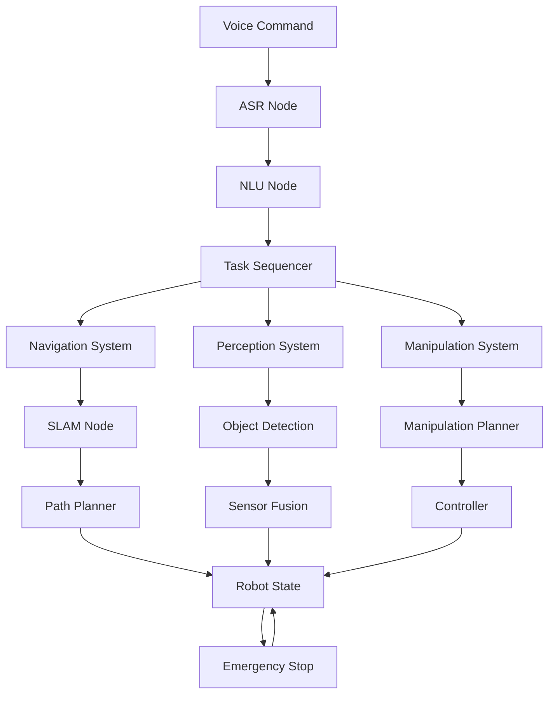

# Chapter 4: ROS 2 Graph Visualization - The Robot's Nervous System

## The ROS 2 Architecture

In this chapter, we dive into the "nervous system" of our robot—ROS 2 (Robot Operating System 2). As outlined in our constitution, ROS 2 serves as the circulatory system of modern robotics, providing modular, distributed, and real-time communication between our robot's components.

## Understanding the ROS 2 Graph

The ROS 2 graph represents the network of nodes, topics, services, and actions that make up our robot's software architecture. Each component communicates through standardized interfaces:

- **Nodes**: Individual processes that perform specific functions
- **Topics**: Publish-subscribe communication for continuous data streams
- **Services**: Request-response communication for discrete interactions
- **Actions**: Goal-oriented communication for long-running tasks

## Building the Communication Infrastructure

Based on our implementation plan, we need to establish the foundational ROS 2 communication infrastructure before implementing any user stories.

### Core Infrastructure Tasks:
- T006: Setup ROS 2 communication infrastructure and core nodes
- T007: Implement robot state machine with safety states
- T008: Setup emergency stop and safety system
- T009: Create base data models
- T010: Configure error handling and logging infrastructure

## Node Architecture for Our Capabilities

### Voice Processing Nodes
```
speech/
├── asr_node (speech-to-text)
├── nlu_node (natural language understanding)
├── tts_node (text-to-speech)
└── command_processor_node (command orchestration)
```

### Navigation Nodes
```
navigation/
├── slam_node (mapping and localization)
├── path_planner_node (path planning)
├── controller_node (motion control)
└── obstacle_detector_node (collision avoidance)
```

### Perception Nodes
```
perception/
├── vision_node (camera processing)
├── object_detector_node (object recognition)
├── sensor_fusion_node (multi-sensor integration)
└── depth_processor_node (3D understanding)
```

### Cognitive Planning Nodes
```
cognitive_planning/
├── task_sequencer_node (action planning)
├── llm_interface_node (language model integration)
└── behavior_selector_node (decision making)
```

## Visualizing the System

### ROS 2 Graph Structure


## Implementation: Graph Visualization Node

Let's create a basic ROS 2 node to visualize our system's communication graph:

```python
#!/usr/bin/env python3
"""
Graph Visualization Node for Physical AI System
This node helps visualize the ROS 2 communication graph
"""
import rclpy
from rclpy.node import Node
from std_msgs.msg import String
from rcl_interfaces.msg import ParameterEvent
import networkx as nx
import matplotlib.pyplot as plt
from threading import Lock

class GraphVisualizer(Node):
    def __init__(self):
        super().__init__('graph_visualizer')

        # Track nodes and connections
        self.graph = nx.DiGraph()
        self.graph_lock = Lock()

        # Publishers and subscribers to monitor
        self.status_pub = self.create_publisher(String, 'system_status', 10)
        self.param_sub = self.create_subscription(
            ParameterEvent,
            '/parameter_events',
            self.param_callback,
            10
        )

        # Timer to periodically visualize the graph
        self.timer = self.create_timer(5.0, self.visualize_graph)

        self.get_logger().info('Graph Visualizer Node Started')

    def param_callback(self, msg):
        """Monitor parameter changes to understand node connections"""
        with self.graph_lock:
            # Add the node that published the parameter event
            node_name = msg.node
            if node_name:
                self.graph.add_node(node_name)

    def visualize_graph(self):
        """Visualize the current ROS 2 graph"""
        with self.graph_lock:
            if len(self.graph.nodes()) > 0:
                # Create a simple visualization
                plt.figure(figsize=(12, 8))
                pos = nx.spring_layout(self.graph)
                nx.draw(self.graph, pos, with_labels=True, node_color='lightblue',
                       node_size=1500, font_size=8, arrows=True)
                plt.title("Physical AI System - ROS 2 Communication Graph")
                plt.savefig('/tmp/ros_graph.png')
                self.get_logger().info('Graph visualization saved to /tmp/ros_graph.png')

                # Publish system status
                status_msg = String()
                status_msg.data = f"System has {len(self.graph.nodes())} nodes and {len(self.graph.edges())} connections"
                self.status_pub.publish(status_msg)

def main(args=None):
    rclpy.init(args=args)
    visualizer = GraphVisualizer()

    try:
        rclpy.spin(visualizer)
    except KeyboardInterrupt:
        pass
    finally:
        visualizer.destroy_node()
        rclpy.shutdown()

if __name__ == '__main__':
    main()
```

## Quality of Service (QoS) Settings

For real-time performance, we need to carefully configure QoS settings:

```python
from rclpy.qos import QoSProfile, ReliabilityPolicy, DurabilityPolicy

# For critical safety messages
critical_qos = QoSProfile(
    depth=1,
    reliability=ReliabilityPolicy.RELIABLE,
    durability=DurabilityPolicy.TRANSIENT_LOCAL
)

# For sensor data (high frequency)
sensor_qos = QoSProfile(
    depth=5,
    reliability=ReliabilityPolicy.BEST_EFFORT,
    durability=DurabilityPolicy.VOLATILE
)

# For command messages
command_qos = QoSProfile(
    depth=10,
    reliability=ReliabilityPolicy.RELIABLE,
    durability=DurabilityPolicy.VOLATILE
)
```

## Safety Integration

Following our constitution's principle that "Safety is Intelligence," all nodes must include safety checks:

1. **Emergency Stop Integration**: Every node must subscribe to the emergency stop topic
2. **Health Monitoring**: Nodes must publish their health status
3. **Timeout Handling**: All communications must include timeout mechanisms
4. **Graceful Degradation**: Systems must operate safely even when components fail

## Testing the Graph

To validate our ROS 2 graph:

```bash
# View all nodes
ros2 node list

# View all topics
ros2 topic list

# View topic types
ros2 topic list -t

# Echo a topic to see data flow
ros2 topic echo /voice_command std_msgs/String

# Visualize the graph
rqt_graph
```

## Looking Forward

Now that we understand the communication architecture, the next chapter will implement our first moving robot node, bringing our communication infrastructure to life with actual robot motion.

[Continue to Chapter 5: First Motion Node](./chapter-5-first-motion.md)